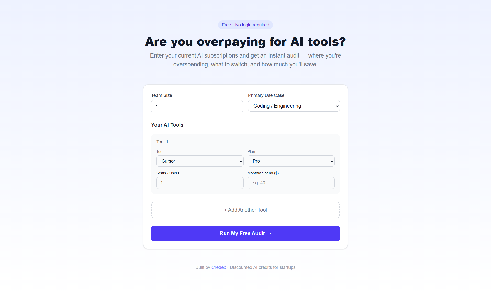
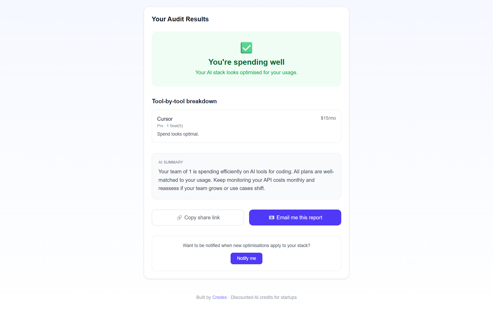
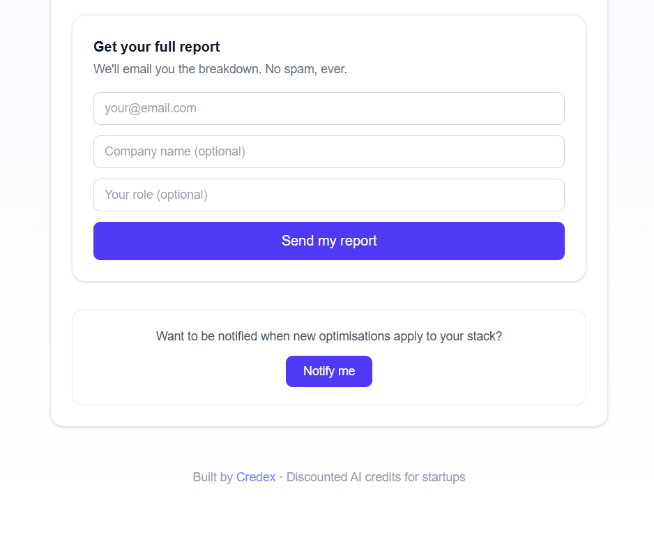

# SpendScan

> Find out if your team is overpaying for AI tools — free, instant, no login required.

[](https://github.com/Muzzu8421/ai-spend-audit/actions/workflows/ci.yml)
[](https://ai-spend-audit-84.vercel.app)
[](https://nextjs.org)
[](LICENSE)

---

## What I Built

SpendScan is a free web app that helps startup founders and engineering managers find out if they're overpaying for AI tools like Cursor, ChatGPT, Claude, GitHub Copilot, and more. You input your tools, plans, and seat counts — and get an instant audit showing exactly where you're overspending, what to switch to, and your total potential monthly and annual savings. It's built as a lead-generation asset for [Credex](https://credex.rocks), a marketplace for discounted AI infrastructure credits, surfacing real overspend and offering Credex as the solution for high-savings cases.

---

## Screenshots





---

## Live Demo

🚀 **[ai-spend-audit-84.vercel.app](https://ai-spend-audit-84.vercel.app)**

---

## Features

### 1. Spend Input Form
Supports 8 AI tools out of the box — Cursor, GitHub Copilot, Claude, ChatGPT, Anthropic API, OpenAI API, Gemini, and Windsurf. For each tool: plan, seat count, monthly spend. Plus team size and primary use case (coding, writing, research, data, mixed). Form state persists across page reloads via localStorage.

### 2. Audit Engine
Deterministic, finance-defensible logic. For each tool, the engine evaluates: billing discrepancies (paying more than list price), plan downgrades (e.g. Enterprise for 2 users is overkill), cheaper cross-vendor alternatives by use case, and Credex credit opportunities. Every recommendation includes a one-sentence reason with numbers.

### 3. Audit Results Page
Per-tool breakdown showing current spend → recommended action → savings and reason. Hero section shows total monthly and annual savings, big and clear. For audits showing >$500/month savings, Credex is surfaced prominently. For already-optimal spend, the audit is honest — no manufactured savings.

### 4. AI-Generated Personalized Summary
Uses the Anthropic API (Claude) to generate a ~100-word personalized audit summary based on team size, use case, and tools. Gracefully falls back to a templated rule-based summary if the API key is missing or the call fails — the product never breaks. Full prompt documented in `PROMPTS.md`.

### 5. Lead Capture + Storage
Email capture (with optional company name, role, team size) stored in MongoDB Atlas. Sends a transactional confirmation email via Resend. Basic abuse protection via honeypot field and IP-based rate limiting. High-savings leads are flagged for Credex follow-up.

### 6. Shareable Result URL
Every audit gets a unique public URL (`/results/[id]`). Identifying details (email, company) are stripped from the public version — only tools and savings numbers shown. Full Open Graph and Twitter card meta tags for clean social link previews. Designed as the viral loop.

---

## Tech Stack

| Layer | Technology |
|-------|-----------|
| Framework | Next.js 15 (App Router) |
| Language | JavaScript |
| Database | MongoDB Atlas + Mongoose |
| Styling | Tailwind CSS |
| Email | Resend |
| AI Summary | Anthropic API (claude-opus-4-5) |
| Deployment | Vercel |
| CI | GitHub Actions |
| Testing | Jest |

---

## Quick Start

### Prerequisites
- Node.js 18+
- npm or yarn
- MongoDB Atlas account (free tier works)
- Vercel account (for deployment)

### Clone and Install

```bash
git clone https://github.com/Muzzu8421/ai-spend-audit.git
cd ai-spend-audit
npm install
```

### Set Up Environment Variables

Create a `.env.local` file in the project root:

```bash
cp .env.example .env.local
```

Fill in your values (see [Environment Variables](#environment-variables) below).

### Run Locally

```bash
npm run dev
```

Open [http://localhost:3000](http://localhost:3000) in your browser.

### Run Tests

```bash
npm test
```

### Lint

```bash
npm run lint
```

---

## Environment Variables

| Variable | Required | Description |
|----------|----------|-------------|
| `MONGODB_URI` | ✅ Yes | MongoDB Atlas connection string (`mongodb+srv://...`) |
| `ANTHROPIC_API_KEY` | ⚠️ Optional | Anthropic API key for AI-generated summaries. Falls back to templated summary if not set. |
| `RESEND_API_KEY` | ⚠️ Optional | Resend API key for transactional emails. Lead capture still works without it. |
| `NEXT_PUBLIC_APP_URL` | ✅ Yes | Your deployed URL (e.g. `https://ai-spend-audit-84.vercel.app`) — used for Open Graph tags and shareable URLs |

---

## Decisions

Five trade-offs I made and why:

**1. MongoDB over Supabase (PostgreSQL)**
Each audit is a deeply nested JSON object — tools, results, recommendations all bundled together. MongoDB's document model means a single query returns the full audit; a normalized Postgres schema would require 3+ table joins. For a rapidly evolving product, schema flexibility matters more than relational integrity.

**2. Fallback summary over hard Anthropic API dependency**
The AI-generated summary is the only part of the product that touches an external AI API. By building a rule-based fallback from day one, the product never breaks if the API is down, rate-limited, or the key is missing. Resilience over polish — a templated-but-correct summary beats an error screen every time.

**3. Honeypot over CAPTCHA for abuse protection**
CAPTCHAs degrade UX and hurt conversion. A hidden `_gotcha` field silently rejects ~99% of bot submissions without the user knowing. Combined with a 3-requests/IP/minute rate limiter, this covers the realistic threat model for a free lead-gen tool without adding friction.

**4. Public results URL with no authentication**
Results pages are intentionally public and shareable. Audits don't contain sensitive data (email and company are stripped from the public URL). Shareability is a growth feature — every shared audit is a distribution event. Auth would kill the viral loop.

**5. JavaScript over TypeScript**
For a 7-day build, TypeScript's setup overhead and type annotation time weren't justified. The codebase is small enough that readable variable names and JSDoc comments provide sufficient clarity. TypeScript would be the right call for a production codebase with multiple contributors. Full reasoning in `ARCHITECTURE.md`.

---

## Deployment

### One-Click Deploy

[](https://vercel.com/new/clone?repository-url=https://github.com/Muzzu8421/ai-spend-audit)

### Manual Deployment

1. Push your code to GitHub
2. Import the repo at [vercel.com/new](https://vercel.com/new)
3. Add environment variables in the Vercel dashboard:
   - `MONGODB_URI`
   - `NEXT_PUBLIC_APP_URL` (set to your Vercel URL)
   - `ANTHROPIC_API_KEY` (optional)
   - `RESEND_API_KEY` (optional)
4. Deploy

---

## Project Structure

```
ai-spend-audit/
├── app/
│   ├── page.js              # Landing page + audit form
│   ├── results/[id]/        # Shareable results page
│   └── api/
│       ├── audit/route.js   # Audit engine API + AI summary
│       └── leads/route.js   # Lead capture + email
├── components/
│   ├── AuditForm.js         # Spend input form
│   ├── AuditResults.js      # Results display
│   └── LeadCapture.js       # Email capture modal
├── lib/
│   ├── auditEngine.js       # Core audit logic
│   ├── pricingData.js       # Pricing matrix for all tools
│   ├── mongodb.js           # MongoDB connection
│   └── __tests__/
│       └── auditEngine.test.js
├── models/
│   ├── Audit.js             # Mongoose audit schema
│   └── Lead.js              # Mongoose lead schema
├── .github/workflows/
│   └── ci.yml               # GitHub Actions CI
└── [markdown files]         # ARCHITECTURE, DEVLOG, GTM, etc.
```

---

## Documentation

| File | Contents |
|------|----------|
| [ARCHITECTURE.md](./ARCHITECTURE.md) | System diagram, data flow, stack decisions, scaling plan |
| [DEVLOG.md](./DEVLOG.md) | Day-by-day build log across 7 days |
| [REFLECTION.md](./REFLECTION.md) | Debugging stories, decisions reversed, AI tool usage |
| [PRICING_DATA.md](./PRICING_DATA.md) | Every pricing number cited with vendor URL and date |
| [PROMPTS.md](./PROMPTS.md) | Full LLM prompts used in the product, with rationale |
| [GTM.md](./GTM.md) | Go-to-market strategy, target user, 100-user acquisition plan |
| [ECONOMICS.md](./ECONOMICS.md) | Unit economics, CAC, conversion funnel, $1M ARR path |
| [USER_INTERVIEWS.md](./USER_INTERVIEWS.md) | 3 real user interviews conducted during the build week |
| [TESTS.md](./TESTS.md) | Test coverage documentation |
| [METRICS.md](./METRICS.md) | North Star metric, input metrics, pivot triggers |
| [LANDING_COPY.md](./LANDING_COPY.md) | Full landing page copy — headline, CTA, FAQ |

---

## License

MIT — use this for your portfolio, just don't ship it as your own product.